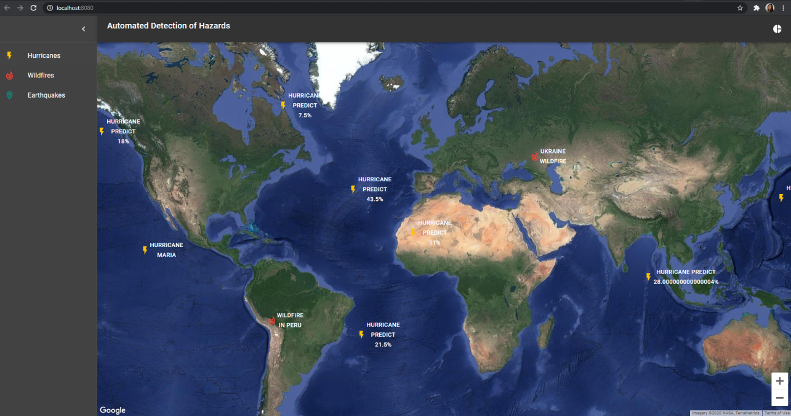
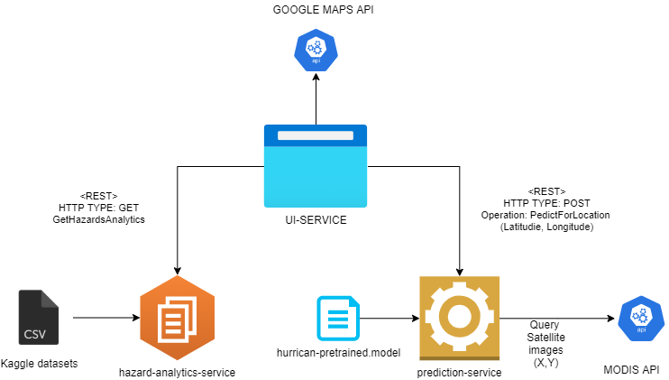

# skyfolks-frontend

NASA Space Apps Hackathon - 2020

NASA, CSA, CNES, JAXA, and ESA invite you to “Take Action” from home on October 2-4, as part of an entirely virtual celebration of our 9th annual hackathon.

Website: https://2020.spaceappschallenge.org/locations/london

## The Challenge

Automated Detection of Hazards

Countless phenomena such as floods, fires, and algae blooms routinely impact ecosystems, economies, and human safety. 

Your challenge is to use satellite data to create a machine learning model that detects a specific phenomenon and build an interface that not only displays the detected phenomenon, but also layers it alongside ancillary data to help researchers and decision-makers better understand its impacts and scope.

## Architecture

## Available Scripts

In the project directory, you can run:

### `npm start`

Runs the app in the development mode. 
Open [http://localhost:3000](http://localhost:3000) to view it in the browser.

The page will reload if you make edits. 
You will also see any lint errors in the console.

### `npm run build`

Builds the app for production to the `build` folder. 
It correctly bundles React in production mode and optimizes the build for the best performance.

The build is minified and the filenames include the hashes. 
Your app is ready to be deployed!

See the section about [deployment](https://facebook.github.io/create-react-app/docs/deployment) for more information.

